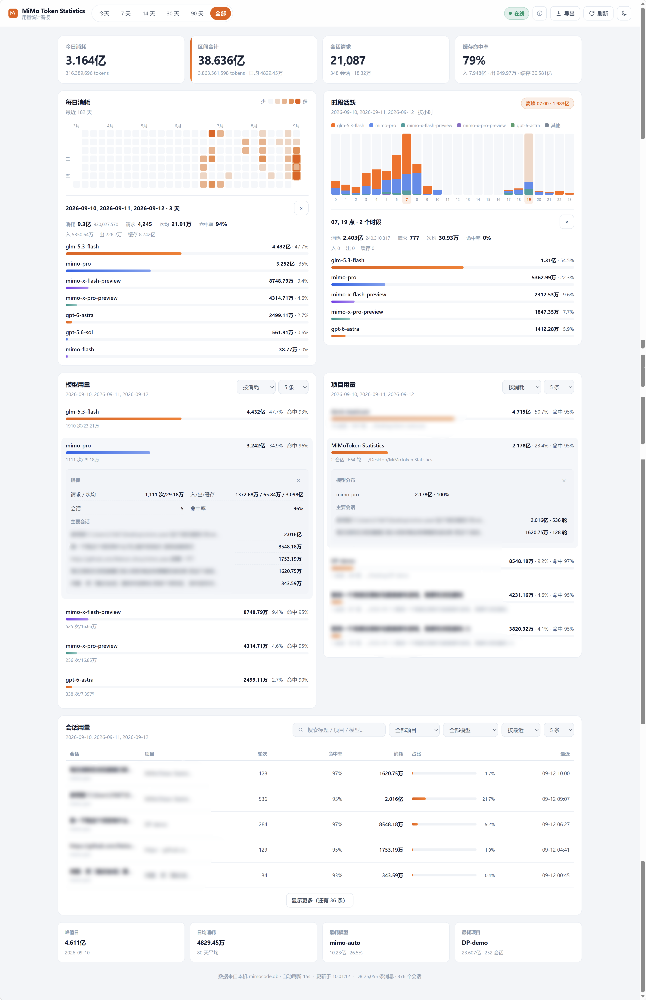

# MiMo Token Statistics

本地 **Xiaomi MiMo Desktop** 的 Token 用量统计看板。

纯 Python 标准库后端 + 静态前端，**零第三方依赖**，拷贝即跑。只读解析本机 `mimocode.db`，不调用小米 API，不上传任何数据。

```
每日贡献热力图  ·  24h 分模型堆叠  ·  模型/项目/会话用量  ·  洞察卡片  ·  CSV 导出
```



## 功能

- **每日消耗**：GitHub 风格贡献热力图（约 26 周）。悬停查看当日构成；单击展开当日明细；**Shift + 点击**可多选日期，右侧「时段活跃」以及下方的模型 / 项目 / 会话用量都会按选中日期重新汇总（再点取消）
- **时段活跃**：24 小时分模型堆叠柱状图。单击某柱查看该小时明细；**Shift + 点击**可多选小时聚合查看
- **模型用量 / 项目用量**：默认 5 条，可调条数；支持按消耗、最近、轮次、次均、输入、输出、缓存、命中率排序；点击可展开明细
- **会话用量**：表格 + 关键词搜索（标题 / 项目 / 模型）+ 项目 / 模型筛选 + 排序与条数控制
- **会话弹窗**：消耗 / 请求·次均 / 入·出·缓存 / 命中率 + 模型分布 + 每次请求明细
- **洞察卡片**：峰值日、日均消耗、最耗模型、最耗项目（随时间范围变化）
- **CSV 导出**、主题默认**跟随系统**（可手动切换并记住）、在线时 15 秒自动刷新（可暂停；快捷键 `R` 立即刷新）
- 响应式布局：窄屏热力图横向滚动并默认露出最近日期；会话表在手机上隐藏项目列、筛选分行
- **访问密码**：默认 `root`，支持局域网 / 内网穿透场景
- 右上角齿轮可打开**设置**（修改访问密码、查看数据说明）

> 术语：界面中的「请求」为带 tokens 的 assistant 消息次数；「次均」= 该范围内总消耗 ÷ 请求次数。

## 环境要求

| 项 | 要求 |
|----|------|
| Python | 3.9+（仅标准库） |
| 数据 | 本机安装并使用过 Xiaomi MiMo Desktop |
| 数据库 | `~/.local/share/mimocode/mimocode.db` |

Windows 路径同样为：`C:\Users\<你>\.local\share\mimocode\mimocode.db`

## 快速开始

### 方式一：GitHub Releases（无需安装 Git）

1. 打开 [Releases](https://github.com/b0bcx/mimo-token-statistics/releases) 下载最新 Source code zip
2. 解压后进入目录
3. 运行：

```bash
python server.py
```

Windows 可双击 `启动统计服务.bat`。

### 方式二：git clone

```bash
git clone https://github.com/b0bcx/mimo-token-statistics.git
cd mimo-token-statistics

# 默认 http://0.0.0.0:8765（本机可用 http://127.0.0.1:8765）
python server.py

# 或
python server.py --port 8765 --host 0.0.0.0 --password root
python server.py --db "/path/to/mimocode.db"
python server.py --no-auth
```

Windows 可双击 `启动统计服务.bat`；结束时可用 `停止统计服务.bat`。

浏览器打开：http://127.0.0.1:8765  

首次访问会进入登录页，**默认密码：`root`**。可用 `--password 你的密码` 或环境变量 `MIMO_STATS_PASSWORD` 修改。

## 访问控制

| 项 | 说明 |
|----|------|
| 默认监听 | `0.0.0.0`（本机 + 局域网；有公网 IP / 内网穿透时也可对外） |
| 默认密码 | `root` |
| 改密码 | `python server.py --password 强口令` 或设 `MIMO_STATS_PASSWORD` |
| 临时关闭鉴权 | `python server.py --no-auth`（仅建议本机使用） |
| 会话 | 登录成功后下发 HttpOnly Cookie，约 30 天有效 |

> 公网部署前请务必修改默认密码；本工具不是专业鉴权网关，建议再套一层反向代理 TLS / 防火墙 / IP 白名单。


## 统计口径

数据仅来自本机 `mimocode.db`，解析 **assistant** 消息中的 `tokens` 字段；统计过程不调用小米 API，数据库以只读方式打开（`mode=ro`）。

- **总消耗** = `input + output + reasoning + cache.read + cache.write`  
  （消息中存在 `tokens.total` 时优先使用该字段）
- **命中率** = `cache.read / (cache.read + cache.write + input)`
- **`mimo-auto`**：旧版 **mimocode CLI** 的 `mimo-auto` 模型 ID，历史数据中仍可能出现。
- **模型 ID 说明**（按数据源原样展示，不自动合并）：
  - `mimo-flash` / `mimo-pro`：桌面端 **Smart** 入口自动路由后的具体模型
  - `mimo-x-flash-preview` / `mimo-x-pro-preview`：未走 Smart 路由的**常规** flash / pro 模型
  - 同一批数据里新旧或不同入口 ID 可能并列出现在排行中

## 数据来源

| 路径 | 用途 |
|------|------|
| `~/.local/share/mimocode/mimocode.db` | 会话与消息 token（必需） |
| Windows：`%APPDATA%\Xiaomi MiMo\Partitions\xiaomi-account\...\Cookies` | 可选：SSO cookie，供 `/api/quota` 查询周配额 |
| macOS：`~/Library/Application Support/Xiaomi MiMo/...` | 同上 |

主统计路径不依赖 cookie；配额接口失败时静默降级，不影响看板。

## HTTP API

| 方法 | 路径 | 说明 |
|------|------|------|
| GET | `/` | 看板页面（需登录） |
| GET | `/login` | 登录页 |
| POST | `/api/login` | 登录。JSON：`{"password":"..."}`；成功下发 Cookie |
| POST | `/api/logout` | 注销当前会话 |
| GET | `/api/auth` | 当前鉴权开关与是否已登录 |
| GET | `/api/overview?range=` | 聚合统计。`range`: `today` \| `7` \| `14` \| `30` \| `90` \| `all`（别名 `/api/usage`） |
| GET | `/api/day-hourly?date=` | 某日 24 小时分模型（日历联动） |
| GET | `/api/days-hourly?dates=` | 多日合并小时分布，`dates` 为逗号分隔日期（Shift 多选） |
| GET | `/api/session?id=` | 单会话明细（最近请求列表） |
| GET | `/api/export.csv?range=` | 按当前范围导出 CSV |
| GET | `/api/health` | 健康检查（别名 `/api/status`） |
| GET | `/api/quota` | 可选：读本机 cookie 查询官方周配额 |
| GET | `/api/refresh` | 清空聚合缓存与全量 items 内存缓存 |

`/api/overview` 响应中还包含 `weekday_hour`（周几 × 小时）聚合，当前界面未单独渲染，可供二次开发使用。

## 项目结构

```
.
├── server.py           # HTTP 服务 + SQLite 聚合（纯标准库）
├── index.html          # 看板入口
├── css/style.css
├── js/app.js
├── 启动统计服务.bat     # Windows 一键启动
├── 停止统计服务.bat     # Windows 停止占用 8765 的服务
├── LICENSE
└── README.md
```

## 安全与隐私

- 默认监听 **`0.0.0.0`**，便于局域网 / 内网穿透访问；仅需本机时可用 `--host 127.0.0.1`
- **默认启用访问密码**（`root`），未登录时看板与 `/api/*` 返回 401 并跳转登录页
- 只读打开数据库，不修改 MiMo 客户端数据  
- 主统计路径无网络上报；仅在显式访问 `/api/quota` 时可能读取本机 cookie 并请求小米接口  
- **请勿**将真实 `mimocode.db` 或含个人用户名路径的截图提交到公开仓库  
- 对外暴露前请修改默认密码，并尽量使用 HTTPS（反代 / 隧道 TLS）  

## 常见问题

**页面提示找不到数据库**  
先确认 MiMo Desktop 已登录并产生过会话；或用 `--db` 指定完整路径。

**排行里出现两个很像的模型**  
可能来自不同入口或客户端阶段：`mimo-flash` / `mimo-pro` 是 Smart 自动路由结果；`mimo-x-flash-preview` / `mimo-x-pro-preview` 是常规 flash / pro；`mimo-auto` 是旧版 mimocode CLI 模型。服务按数据源原样展示，不会自动合并。

**「今天」切「全部」有点慢**  
首次会扫一次库并常驻内存（约 180 秒）；之后各时间范围切换通常只有几十毫秒。可点「刷新」强制重建缓存。

**自动刷新会不会很耗性能？**  
基本不耗。默认每 15 秒请求一次本机聚合接口，服务端有约 180 秒缓存，通常只是读缓存 JSON，不会每次重扫数据库；页面切到后台会自动暂停轮询。若仍想省电，可点「在线」暂停，或只按 `R` 手动刷新。

## License

[MIT](./LICENSE)
